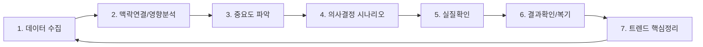

# 투자 운용철학: 마구티어 플라이휠

## 핵심 철학

> **문제**: 시장방향성 및 주고객 심리이해&행동 가능성 및 영향력 예측...미래최고선호기업축적...운영

## 플라이휠 7단계

| 단계 | 핵심 활동 | 워크플로우 |
|------|----------|-----------|
| 1 | 뉴스, 블로그, 텔레그램, 보고서 자동 수집 | `/01-data-collection` |
| 2 | 투자자심리 → 가능행동 유형(고객별) | `/02-context-analysis` |
| 3 | 시장/섹터/종목 영향 및 방향성 추정 | `/03-importance-evaluation` |
| 4 | 행동 시나리오 및 우선순위 정리 | `/04-decision-scenario` |
| 5 | 시세/실제행동 확인 및 대응 | `/05-execution-check` |
| 6 | 복기 및 개선점 도출 | `/06-review-improvement` |
| 7 | 독서/리서치 인사이트 정리 | `/07-trend-research` |

---

## 투자의 본질

> "시대의 방향(바람, 파도...WHY...본질)을 체감하고...
> 관련된 자(기업)들을 탐색하고...
> 준비된(고객가치혁신에 대한 HOW) 자들 중 최고의 가능성을 지닌 자를 
> 발굴하면서 검증해나가는 과정"

### 변화 = 기회 + 리스크

- **변화는 기회**: 매수자 관점
- **변화는 리스크**: 기존 추세종목 보유자 관점
- 새로운 추세가 **수익**이자 **손실**이다

### 나의 고객 정의

> 나는 **중장기 투자**를 지향한다.

| 구분 | 정의 |
|------|------|
| **나의 고객** | 보유종목을 좋은 가격에 사주는 **중장기 투자자들** |
| **투자 대상** | 중장기 보유가 적합한 **선호되는 좋은 종목** |
| **투자 전략** | 선별 매수 → 보유 → 고객(중장기 투자자)에게 매도 |

### 매수/매도 관점

#### 📈 매수 관점
- 중장기 보유에 적합한 **선호되는 좋은 종목** 선별
- 다른 중장기 투자자(고객)가 좋은 가격에 사줄 종목

#### 📉 매도 관점
**트리거 조건:**
- 상승 후 **가격부담**이 느껴지는 종목
- **변동성**이 심해지는 시장 상황

**평가 프로세스:**
1. 중요 관련 이슈에 대한 **데이터 수집 및 모니터링**
2. 이슈와 **투자심리를 맥락적으로 연계 추정**
3. 종합적 영향의 **하락 방향성** 지속 여부 평가

**매도 확률 판단:**
> 이슈들의 종합적 영향 → 하락 방향성 **지속적 상승** → **매도 가능성 확률 ↑**

---

## 위대한 기업 찾기

### 핵심 기준
1. **고객가치제안**을 명확히 이해하고 있는 기업
2. **변화에 민감하게 반응**하는 기업
3. 환경을 지배하거나 **환경을 바꾸는** 기업

### 고객가치제안 정의

> **고객가치제안** = 핵심/잠재 고객에게 경쟁사 대비 **확실한 차별적 혜택**을 주는 철학·미션과 실질적 행동

**평가 요소:**

| 평가 항목 | 내용 | 평가 |
|----------|------|------|
| **철학/미션** | 차별적 혜택을 주는 명확한 철학이 있는가 | ⭕/❌ |
| **실질적 행동** | 철학을 실행하는 구체적 행동이 있는가 | ⭕/❌ |
| **경쟁력 증거** | 실질적 경쟁력 상승의 증거가 있는가 | ⭕/❌ |

### 기업 평가 프레임워크

#### 1. 산업 평가 (빅트렌드 부합)
| 항목 | 높은 평가 | 낮은 평가 |
|------|----------|----------|
| 빅트렌드 부합 | 트렌드 중심 산업 | 쇠퇴 산업 |
| 해자요인 | 과점/독점적 요인 多 | 진입장벽 낮음 |
| 성장 변수 | 변수 적음 (리스크↓) | 변수 많음 (리스크↑) |

#### 2. 경쟁력 평가 (동일 산업 내)
- 경쟁사 대비 차별적 혜택 수준
- 고객가치제안의 실행력
- 경쟁력 상승 증거 유무

### 브랜딩 관점
> "훌륭한 기업을 발굴하고 검증...
> 가치있는 기업을 통한 노력의 대가를 진실되게 얻어갈 수 있는 세상"

---

## 관점 프레임워크

### 공감 관점
- **이슈 성격 진단**: 핵심 이슈(시장/종목)의 단기·중장기 영향 및 기대·우려 요소 구분
- **투자자별 관점 반영**:
  - **단기 투자자**: 즉각적 변동성 및 수급 심리 파악
  - **중장기 투자자**: 구조적 변화 및 펀더멘털 영향 분석
  - **보유자**: 기존 평가 유효성 검토 및 대응 시나리오 점검
  - **잠재 투자자**: 진입 적기 및 기대 수익률 평가

### 시간 관점

---

## 일상 리서치 키워드

| 영역 | 키워드 |
|------|--------|
| 리서치 | 탐색, 탐사, 탐구 |
